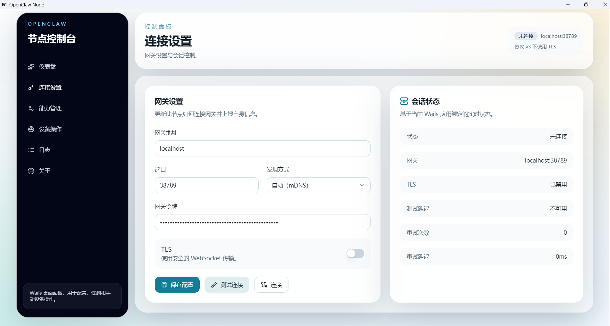

# OpenClaw Node 桌面节点

> 版本说明：当前仓库仅在 OpenClaw `2026.3.8` 版本上完成过联调与验证。

将桌面设备接入 OpenClaw 网关，提供设备能力（camera、location、screen 等）、运行状态与操作入口。

## 运行模式

- **CLI 模式**：协议调试、参数注入、自动化脚本
- **Wails 桌面模式**：连接配置、能力开关、日志查看



## 核心能力

- 连接 OpenClaw Gateway（手动指定或 mDNS 自动发现）
- 注册并上报节点身份、能力集合、命令集合
- 能力模块：`camera`、`location`、`photos`、`screen`、`motion`、`notifications`、`sms`、`calendar`

## 技术栈

- 后端：Go 1.20 | 桌面框架：Wails v2 | 前端：React 18 + TypeScript + Vite + Tailwind CSS
- 通信：WebSocket + 自定义协议层

## 项目结构

```
.
├─ main.go                 # Wails 桌面入口
├─ cmd/                    # CLI 入口
├─ internal/
│  ├─ protocol/            # 网关通信、连接与命令分发
│  ├─ device/              # 设备能力注册、平台能力实现
│  ├─ wails/               # Wails 绑定
│  ├─ tray/                # 托盘
│  ├─ config/              # 配置
│  └─ discovery/           # mDNS 发现
├─ frontend/               # React 前端
└─ store/                  # 数据目录（%APPDATA%\OpenClaw）
```

## 快速开始

```powershell
# 安装依赖
go install github.com/wailsapp/wails/v2/cmd/wails@v2.7.1
cd frontend && npm install && cd ..

# 构建 CLI
go build -o openclaw-node.exe ./cmd

# 桌面开发
wails dev

# 桌面打包
wails build
```

## CLI 参数

```powershell
.\openclaw-node.exe -gateway 127.0.0.1:18789 -token your-token -tls
```

| 参数 | 说明 |
|------|------|
| `-gateway` | 网关地址 `host:port` |
| `-token` | 网关鉴权 Token |
| `-tls` | 启用 TLS |
| `-no-mdns` | 关闭 mDNS 自动发现 |

## 配置

数据目录：`%APPDATA%\OpenClaw`

- `identity.json` - 设备身份与密钥
- `config.yaml` - 连接配置、能力开关

`config.yaml` 示例：

```yaml
gateway: gateway.example.com
port: 18789
token: your-token
tls: true
discovery: auto
capabilities:
  camera: true
  location: true
  photos: true
  screen: true
```

**CLI 参数优先级高于 config.yaml**，仅影响当前进程。

## 前端

```powershell
cd frontend
npm run dev      # 开发
npm run build     # 构建
```

## 测试

```powershell
go test ./...                    # 所有测试
go test -v ./internal/protocol/  # 协议层测试
```
